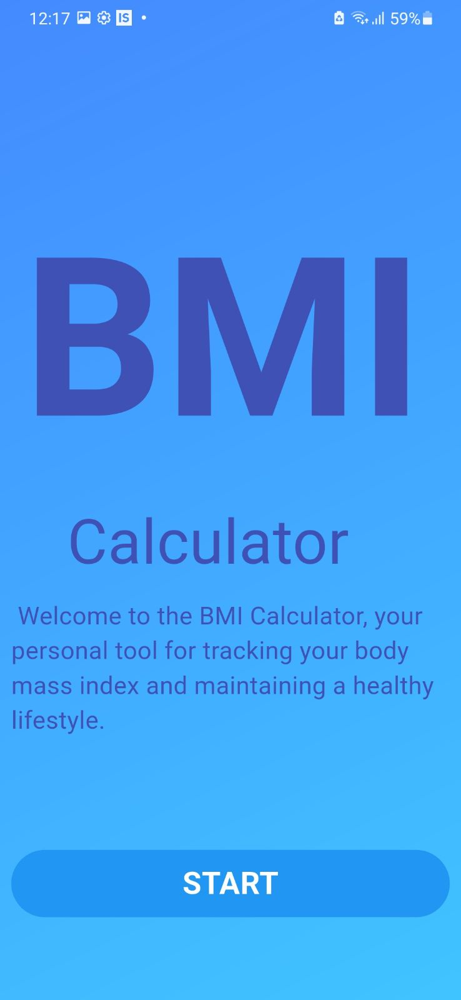
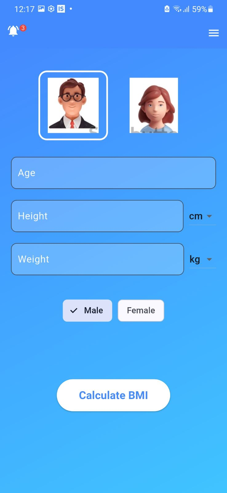
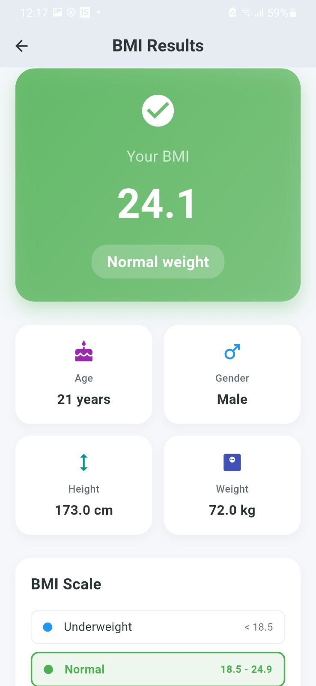

# BMI Calculator (Flutter)

A simple, modern BMI (Body Mass Index) calculator built with Flutter. Enter your age, height, weight, and select gender using tappable images. The app converts units automatically (cm/m/ft and kg/lbs), computes BMI, and shows your result on a dedicated screen.

> Built to be lightweight, beginner-friendly, and easy to extend—perfect for learning Flutter UI, navigation, and basic form handling.

---

## ✨ Features

- Gender selection via **image tiles** (Male/Female) + optional ChoiceChips
- Height units: **cm / m / ft**
- Weight units: **kg / lbs**
- Input validation hooks (ready to expand)
- Clean gradient UI + responsive layout
- Dedicated **Result Screen** for BMI value & category

---

## 📸 Screenshots

| Details (Form) | Gender Select | Result Screen |
|---|---|---|
|  |  |  |

*(Make sure these image files exist in your repo at `assets/images/` — otherwise update the paths accordingly.)*

---

## 🧮 BMI Formula & Units

**BMI** = weight(kg) ÷ (height(m))²

Conversions used internally:
- If height in **cm** → meters = cm / 100
- If height in **ft** → meters = ft × 0.3048
- If weight in **lbs** → kg = lbs × 0.45359237

👉 You can centralize these conversions in a utility to keep `ResultPage` tidy.

### BMI Categories (WHO guideline)
- **< 18.5**: Underweight
- **18.5–24.9**: Normal
- **25.0–29.9**: Overweight
- **≥ 30.0**: Obese

---

## 🗂️ Project Structure (excerpt)

